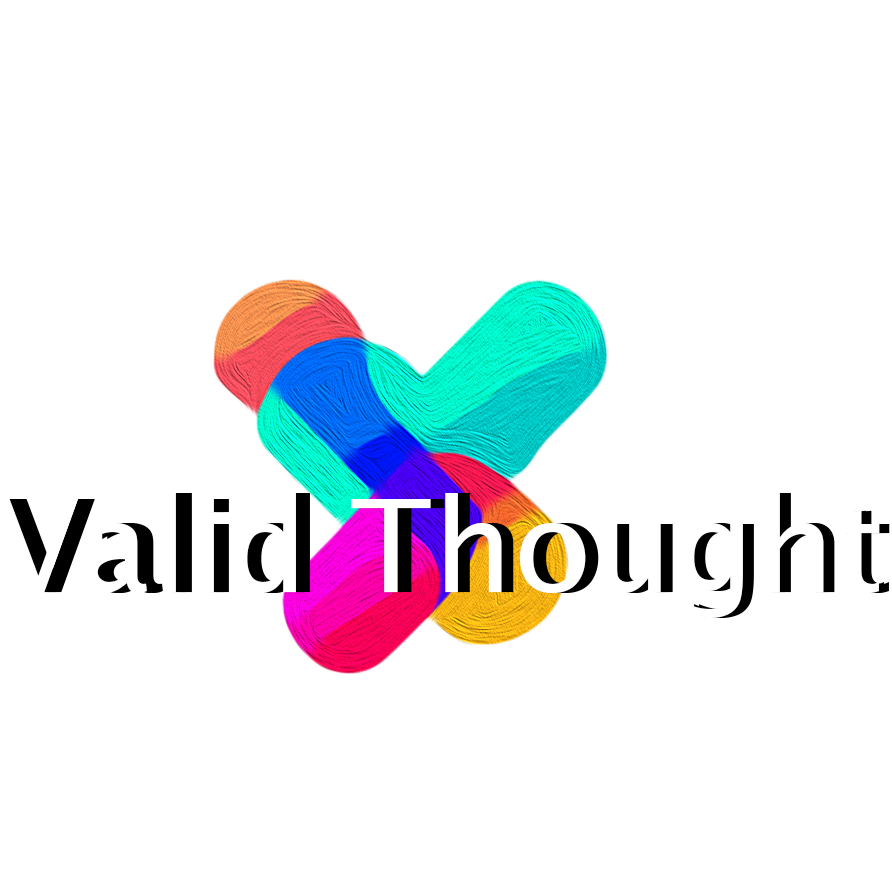

# Welcome to Valid Thought :earth_americas:

We're all about making the digital world clear and open to everyone. :bulb:

Our big aim :dart: is to help everyone talk honestly with people in charge :speaking_head:. We want to work together :handshake: to make our world include everyone :globe_with_meridians:.

By using smart tech :desktop_computer: that changes text and language :abcd:, we're trying to build a computer system :computer: that everyone can use :raised_hands:. This system is designed to be easy to check :white_check_mark: and understand :brain:, whether you're the one using it :bust_in_silhouette: or the one running it :busts_in_silhouette:.

We're set on creating a system that's open :unlock:, responsible :balance_scale:, and easy to use for everyone :people_holding_hands:. This is a new way :new: of doing things in the world of computer learning :robot:. Come join us :hand: as we work to make tech understandable :book: and useful :wrench: for all, no matter who you are :heart:.

